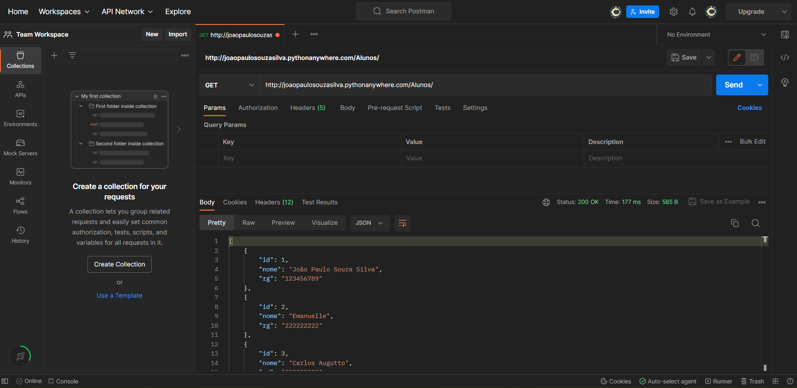
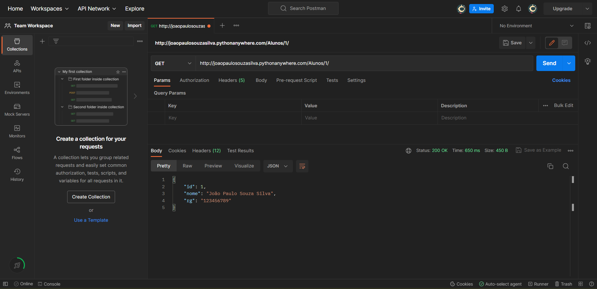
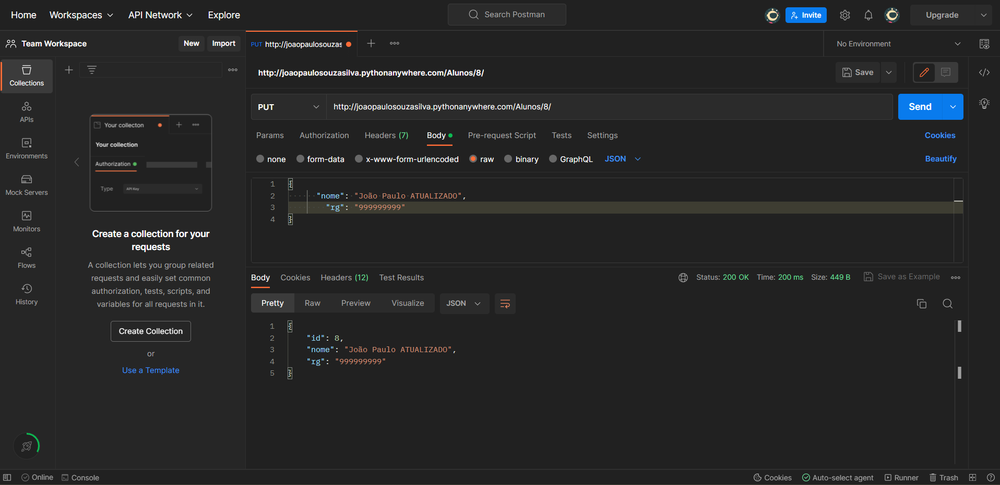
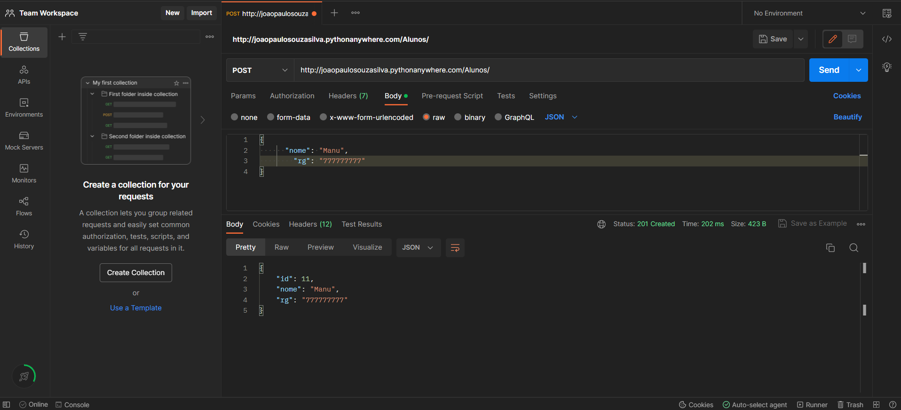
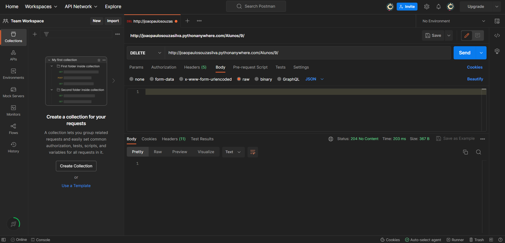
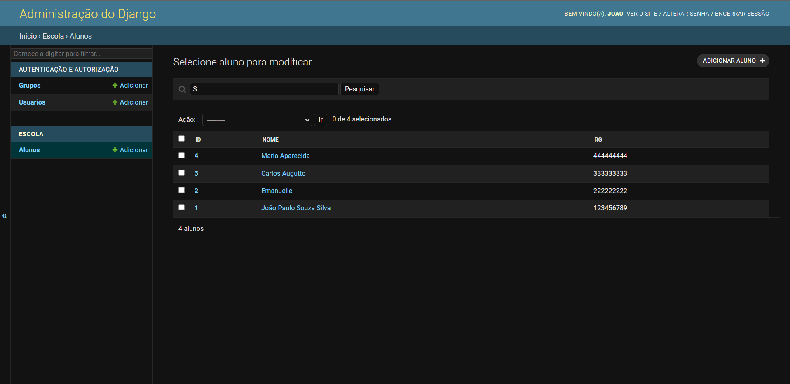
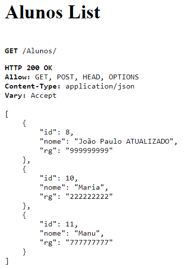

<h1>🔧 Criando minha primeira API</h1>

<h3>📃 Descrição do projeto: </h3>
<hr>
<p>
  O projeto em questão foi muito importante para desenvolver meu conhecimento com relação a API, desde de o que significa, para que serve, como utilizar, como criar, o que seria a API rest, como unir com um banco de dados e entre outros assuntos. A partir desse estudo, foi possível criar minha primeira API que representa a lista de alunos de uma escola, para o desenvolvimento do projeto foi utilizado o Python, o Django juntamente como o Sqlite, por meio do Visual Studio Code. Durante a criação, tive algumas dificuldades, como: a utilização de comandos no terminal, tendo em vista que não possuía costume em utilizar, a utilização do Django, pois já tinha conhecimento da existência do mesmo, mas esse foi meu primeiro contato direto, entre outras dificuldades. Entretanto, por mais que tive algumas dificuldades, fiquei deslumbrado com os "poderes mágicos" do Django, principalmente com a possibilidade de criar uma super usuário, em outras palavras, um admin que consegue administrar todo o conteúdo da API.
</p>
<br>

<h3>🔨 Ferramentas utilizadas: </h3>
<hr>
<p>
  Para desenvolver este projeto, é necessário um editor de código, recomendo o Visual Studio Code, que pode ser baixado gratuitamente. Por precaução, é necessário ter um navegador web instalado em seu computador, nesse projeto foi usado o Chrome. Além desses, será necessário a instalação de algumas dependências e será utilizadas algumas ferramentas online, essas dependências e ferramentas são descritas e explicadas na seção "Como replicar o projeto", visto que desse modo ficará mais simples a compreensão.
</p>

  <h4>Visual Studio Code v1.76</h4>
  <ul>
      <li>Acesse o site oficial do Visual Studio Code em https://code.visualstudio.com/.</li>
      <li>Clique no botão "Download" na página inicial.</li>
      <li>Escolha o download apropriado para o seu sistema operacional (Windows, Mac ou Linux).</li>
      <li>Após o download, execute o arquivo de instalação e siga as instruções na tela.</li>
  </ul>

  <h4>Google Chrome v110</h4>
  <ul>
      <li>Acesse o site oficial do Google Chrome em https://www.google.com/chrome/</li>
      <li>Clique no botão "Download" (ou "Baixar") para baixar o instalador do Chrome para o seu sistema operacional (Windows, Mac ou Linux)</li>
      <li>Após o download, execute o arquivo de instalação e siga as instruções na tela.</li>
  </ul>
<br>

<h3>🔁 Como replicar o projeto: </h3>
<hr>
<p>
  Inicialmente deve ser criado uma pasta para colocarmos a nossa API dentro, no exemplo a pasta vai ser chamada de API. Agora iremos criar o ambiente virtual, no terminal do vscode, o botão está localizado na parte superior esquerda, após aberto, digite o comando:

  ```
       python3 -m venv ./venv
  ```

  ⚠️ É importante ressaltar que sempre após a escrita de um comando no terminal, deve-se pressionar o enter, para que o comando seja executado.

  ❌ Nesse momento, no meu projeto deu um erro pois não havia instalado o python 3, caso o mesmo aconteça, na mensagem de erro irá aparecer um link para baixar, aperte Ctrl e clique nele e abrirá a opção de instalar, após o fim da instalação, reescreva o comando anterior ou aperte a tecla de seta para cima e pressione enter. Se aparecer uma pasta chamada “ venv ” dentro da pasta API no caso do exemplo, significa que o ambiente virtual foi criado.

  Agora devemos ativar a venv, também no terminal deve-se digitar o comando:

  ```
       venv/Scripts/activate
  ```

  ⚠️ É importante ressaltar que esse comando é para o sistema operacional windows, caso o sistema operacional seja o mac ou linux, use o comando ( <strong> source venv/bin/activate </strong> ).

  Após apertar o enter, na nova linha que aparecer, deve conter como primeira palavra o (venv), isso significa que o ambiente virtual foi ativado. 

  Agora iremos iniciar a instalação das dependências do ambiente virtual, primeiramente instalaremos o Django com o seguinte comando 

  ```
       pip install django
  ```

  Possivelmente o terminal indicará um upgrading, e lhe dará o comando, o mesmo estará amarelo, caso não encontre o comando para o upgrading, digite o seguinte comando ( <strong> pip install –upgrade pip </strong> ) 

  Para termos certeza de que o django foi instalado, usaremos o seguinte comando para visualizarmos quais as dependências que o projeto possui

  ```
       pip freeze 
  ```

  O terminal retornará uma lista  de dependências e é necessário que o django esteja presente para prosseguirmos. 

  Agora iremos criar a nossa aplicação, a partir do comando  

  ```
       django-admin startproject config
  ```

  O <strong> django-admin </strong> será responsável por todas as configurações da nossa aplicação, para confirmarmos que deu tudo certo, dentro da nossa pasta API, terá uma nova pasta chamada config e um arquivo .py chamado manage. 

  Para rodar o nosso servidor devemos utilizar o comando 

  ```
       python manage.py runserver 
  ```

  ❌ Após apertar enter, aparecerá uma mensagem dizendo que existem algumas migrações pendentes, mais a frente resolveremos esse ponto. 

  ⚠️ É importante ressaltar que quando instalamos o Django a gente já terá o sqlite integrado nele, sendo assim, não vamos precisar instalar um outro banco de dados. 

  Juntamente com a mensagem citada anteriormente, aparecerá no terminal o link para o servidor que está na nossa máquina, entretanto, o mesmo está em inglês, para mudarmos isso, vamos seguir o seguinte passo a passo

  Dentro da nossa pasta <strong> API </strong>, vamos acessar a aba <strong> config </strong> e o arquivo <strong> settings.py </strong>, nesse arquivo terá todas as configrações da nossa aplicação, devemos procurar dentro dele duas linhas a primeira é <strong> LANGUAGE_CODE = ‘en-us’ </strong> e mudar para <strong> LANGUAGE_CODE = ‘pt-br’ </strong> e a segunda é <strong> TIME_ZONE = ‘UTC’ </strong> e mudar para <strong> TIME_ZONE = ‘America/Sao_Paulo’ </strong>, após essas mudanças, quando atualizarmos a página do servidor, ela estará em portugues Brasil, essas alterações são importantes pois vai manter toda nossa infraestrutura em portugues.

  As mudanças ficaram da seguinte forma

  <p>
    <strong> LANGUAGE_CODE = ‘en-us’ </strong> → <strong> LANGUAGE_CODE = ‘pt-br’ </strong>
  </p>

  <p>
    <strong> TIME_ZONE = ‘UTC’ </strong> → <strong> TIME_ZONE = ‘America/Sao_Paulo’ </strong>
  </p>

  Iremos agora inicializar e criar uma aplicação, primeiro vamos abrir outro terminal, ( o terminal utilizado até aqui não receberá mais comandos, sendo assim todas as vezes que nos referimos ao terminal será o novo terminal ou segundo terminal ) para isso basta repetir o processo que foi feito para abrir o primeiro terminal e vamos inicializar o venv, assim como foi feito no primeiro terminal, a partir do comando 

  ```
     venv/Scripts/activate
  ```

  Para criar a aplicação vamos primeiro, definir um nome, que nesse caso será escola, vamos dar o comando para criar o app 

  ```
       python manage.py startapp escola
  ```

  Se tudo ocorrer corretamente, iremos ter mais uma pasta dentro da nossa pasta mãe API, porém essa terá o nome de <strong> escola </strong>, dentro dela, cada arquivo será responsável por uma funcionalidade.

  Vamos criar um modelo de aluno e migrar esse modelo para o banco de dados, resolvendo o ponto que ficou em aberto anteriormente, para isso devemos abrir o arquivo modelos.py que está dentro da pasta escola e dentro do modelo vamos inserir o seguinte código 

  ```
      class Aluno(models.Model):
        nome = models.CharField(max_length=30)
        rg = models.CharField(max_length=9)

      def __str__(self):
        return self.nome
  ```

  ❔ No primeiro bloco de código é definido quais os atributos que compõem o modelo aluno, além de tipo de atributo e nesse caso o espaço máximo do campo. Já no segundo bloco é definido que os alunos serão representados através do nome.

  Vamos migrar esse modelo para o banco de dados, através do nosso segundo terminal com o seguinte código

  ```
       python manage.py makemigrations
  ```
  ❌ Após confirmar, aparecerá uma mensagem dizendo que não foi detectada nenhuma migração, para resolver isso, basta abrirmos a pasta config e no arquivo settings.py no bloco chamado <strong> INSTELLED_APPS </strong> e dentro dele adicione a seguinte linha

  ```
      ‘escola’,  
  ```
  Quando realizarmos o comando anterior novamente no terminal, ele vai informar que existem migrações disponíveis, entretanto esses dados não foram inseridos no banco de dados, para fazer isso devemos inserir o seguinte código no terminal 

  ```
       python manage.py migrate 
  ```

  Para podermos ver o que fizemos até aqui vamos criar alguns alunos, para isso vamos abrir o admin.py que está na pasta escola e dentro desse arquivo vamos importar o modelo de aluno, vamos fazer isso através do import inserindo o seguinte código no arquivo  

  ```
      from escola.models import Aluno 
  ```

  Vamos agora inserir algumas configurações de como será exibido o modelo, fazendo isso a partir do seguinte código (também dentro do arquivo admin.py)

  ```
      class Alunos(admin.ModelAdmin):
        list_display = (‘id’, ‘nome’, ‘rg’)
        list_display_links = (‘id’, ‘nome’)
        search_fields = (‘nome’,)
  ```

  ❔ O list_display mostrar os campos que serão exibidos sobre o aluno, é possível perceber que não foi criado o campo ID para o aluno, entretanto o django assume que vai ocorrer algum tipo de relação e cada aluno ganhará um ID 

  ❔ O list_display_links são os campos que é possível clicar para manipular os dados dessa informação 

  ❔ O search_fields possibilita que os alunos sejam pesquisados 

  Para visualizar uma coisa interessante, acesse o link do seu servidor e coloque ao fim a url o ( /admin ), aparecerá uma área de login, entretanto, em nenhum momento criamos uma admin, faremos isso agora através do terminal, com o seguinte comando

  ```
    python manage.py createsuperuser
  ```

  A Partir desse momento o terminal lhe fará quatro perguntas, nome do usuário, endereço de email, password, password (again). Pontos importante com relação às senhas, diferente das outras perguntas, o campo de senha não apresentara caracteres, portanto tenha bastante atenção, outra informação é que dependendo da senha escolinha, aparecerá uma mensagem dizendo que a senha é muito comum, basta apertar a tecla “Y” e apertar enter que o admin será criado. Se atualizarmos o nosso servidor com o /admin no fim da url e colocarmos o usuário e login, teremos acesso ao painel de administrador que do jeito que está consegue atribuir níveis de usuários entretanto não aparece nada sobre a escola e para isso precisamos registrar as configurações de aluno no painel de admin, isso será feito no arquivo admin.py adicionando a seguinte linha

  ```
      admin.site.register(Aluno, Alunos)
  ```

  Assim que atualizarmos o site aparecerá a área escola com o campo aluno, para adicionar ou modificar os alunos, se clicar em alunos, irá perceber que não existem alunos cadastrados, porém basta clicar no botão ( adicionar aluno ) que se encontra na parte superior direita da tela, após adicionar as informações sobre o aluno clique em salvar e assim que voltar ao início e clicar em alunos novamente perceberá que o aluno que foi inserido a lista com os alunos aparecerá, se clicar sobre o id ou o nome aparecerá o painel que possibilita alterar, salvar e excluir aluno

  Para fazer a utilização da API por meio da url utilizando os verbos http, iremos utilizar o django rest framework, para um passo a passo mais elaborado de como utilizá lo, basta acessar a sua documentação através do link https://www.django-rest-framework.org/, a primeira coisa que nós vamos fazer assim como fizemos com o django é instalar o django rest framework através do comando 

  ```
   pip install djangorestframework
  ```
  ⚠️ Para limpar o terminal aperte Ctrl + L

  Para conferir basta utilizar o comando já citado anteriormente 

  Além de instalá-lo precisamos adicioná-lo na lista de <strong> INSTELLED_APPS </strong> que fica dentro da pasta config no arquivo settings.py e adcionar 

  ```
  ‘rest_framework’,
  ```

  Agora o django rest framework está definitivamente instalado.

  Quando ocorrer a solicitação para determinado endereço como o /alunos, nós queremos que essas informações sejam disponibilizadas em uma linguagem que é comum pelas apis que é o json, tanto na relação de entregar os dados de uma forma para quem receber consiga entender e quem deseja inserir algo a api consiga entender, é necessário fazer a conversão para o jason e quem faz essa alteração é o serializer, para fazer ele funcionar, é necessario criar um arquivo chamado serializer.py dentro da pasta escola e para conseguirmos utilizá-lo precisamos inserir as seguintes linhas

  ```
  from rest_framework import serializers
  from escola.models import Aluno

  class AlunoSerializer(serializers.ModelSerializer):
    class Meta:
      model = Aluno
      fields = [‘id’, ‘nome’, ‘rg’]
  ```

  ⚠️ Para mais informações sobre o serializer, acesse a documentação do django rest framework

  Continuando nosso processo, abra o arquivo views.py, primeiro apague tudo que está no arquivo e seguir as seguintes linhas  

  ```
  from rest_framework import viewsets
  from escola.models import Aluno
  from escola.serializer import AlunoSerializer

  class AlunosViewSet(viewsets.ModelsViewSet):
    queryset = Aluno.objects.all()
    serializer class = Aluno Serializer
  ```
  Nesse momento nosso controle está preparado para receber get, post, put, delete e entre outros. 

  Próximo passo é configurar as urls, abrindo configs e no arquivo urls.py estão todas as urls da nossa aplicação, vamos inserir o seguinte código 

  ```
  from django.urls import path, include
  from escola.views import AlunosViewSet
  from rest_framework import routers

  router = routers.DefaultRouter()
  router.register(r’alunos’, AlunosViewSet)
  ```
  Dentro do bloco do urlpatterns insira o código 

  ```
  path(‘ ’, include(router.urls)),
  ```
  A partir de agora quando acessarmos o site a API já estará visível e funcionando na sua máquina que é possível, inserir aluno, excluir aluno e atualizar aluno, e todas essas alterações serão salvas na API

  Agora vamos hospedar nosso site através do pythonanywhere que é uma ferramenta gratuita, e para isso basta possuir uma conta no  pythonanywhere clicando no link https://www.pythonanywhere.com/registration/register/beginner/ e possuir uma conta com um repositorio no github, para criar sua conta no github acesse https://github.com/signup?ref_cta=Sign+up&ref_loc=header+logged+out&ref_page=%2F&source=header-home e para fazer upload do projeto no github, siga os passo de https://www.geeksforgeeks.org/how-to-upload-a-project-on-github/ 

  Para realizar a hospedagem, após os passos anteriores, basta seguir o passo a passo que se encontra no seguinte link https://acervolima.com/como-implantar-o-projeto-django-no-pythonanywhere/ 

  É importante ressaltar que existem outras maneiras de criar uma API, sendo através de outras linguagens, ou até mesmo usando o Django com outros banco de dados, por exemplo se quiser usar o Django com o postgres acesse o passo a passo do link https://horadecodar.com.br/2019/01/24/integrando-django-com-postegresql-windows-e-linux/. Outra informação necessária é que a API criada não possui interação com o Dbaas(software e/ou serviços que permitem que usuários configurem, operem e escalem bancos de dados sem precisar configurar hardware físico, instalar softwares ou configurar para desempenho. Todas as tarefas administrativas e a manutenção são conduzidas pelo fornecedor do serviço e tudo que o usuário ou proprietário da aplicação precisa fazer é acessar e usar o banco de dados. Obviamente, o nível de controle pode variar, dependendo do que o usuário prefere e do que o fornecedor do serviço oferece. )
</p>

<h3>🚩 End-Points</h3>
<hr>
<p>
  Um end-point nada mais é que uma url usada para ter acesso aos dados, em um exemplo mais prático, a url base que foi gerada para a gente quando iniciamos o nosso server é como se fosse um prédio e cada parte adicionada ao final fosse uma sala, por exemplo vamos chamar nossa url base de Escola, como usamos anteriormente o /admin, nesse exemplo do prédio é como se quando acessarmos o Escola/admin estivéssemos entrado na escola e acessado a sala da administração.

  ⚠️ É importante ressaltar que o /admin não é um end-point, o mesmo foi utilizado no exemplo com o intuito de torná-lo mais fácil de visualizar

  A APi que construímos, por ser um exemplo simples que tem como intuito ensinar como se cria uma api utilizando django e postgre, possui dois end-pionts que são o ``` /Aluno ```, que mostra a tabela com todos os alunos que estão inseridos no nosso banco de dados, e o ``` /Aluno/(id) ```, que mostra a informações de um aluno a partir do seu id que foi inserido no end-point. Para realizarmos um teste com esses nossos end-points, utilizaremos a plataforma do Postman, uma plataforma gratuita que tem como objetivo testar os end-points, entretanto, é necessário possuir uma conta na site para que possa realizar o seu teste, para fazer inscrição acesse https://identity.getpostman.com/signup. 

  Assim que criar uma conta no postman, clique no botão (+) que se encontra próximo ao botão ( explore - último botão do menu, abrirá um novo campo que terá uma caixa de texto onde será inserido o nosso link juntamente com o end-point(o campo em questão está ao lado do botão azul escrito “Send” e no campo de texto estará escrito “Enter url or paste text” )).

  Testando os End-Points 

  <div style="text-align: center;";>
    
    
  </div>

  Existem outras funções a serem testadas, como o update, o post e o delete, para realizar o update, é preciso mudar o get para o PUT e assim será possível fazer a atualização, para fazer o post(adicionar) é necessário mudar o botão para POST e para deletar tem que fazer a mesma alteração, mas para DELETE, segue o resultado dos exemplos em ordem.

  ⚠️ Para fazer essas alterações é preciso também, selecionar a opção (raw) que está dentro de body, que se encontra abaixo da caixa de texto que inserimos a url  e também alterar a opção (txt) para (JSON), ela se encontra na mesma linha que o (raw) e está na cor azul. 

  Update 
  <div style="text-align: center;";>
    
  </div>

  Post
   <div style="text-align: center;";>
    
  </div>

  Delete
  <div style="text-align: center;";>
    
  </div>

  Todas as alterações feitas no postman, são salvas e alteradas na nossa API, abaixo estão imagens do antes e depois na sequência

  Antes 
  <div style="text-align: center;";>
    
  </div>

  Depois  
  <div style="text-align: center;";>
    
  </div>


</p>